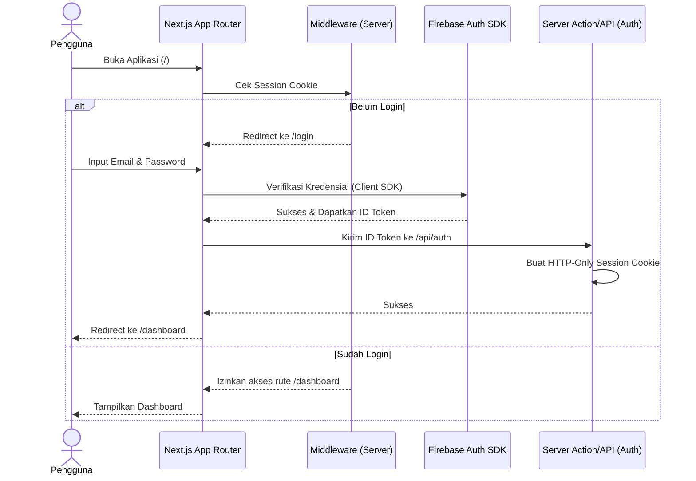
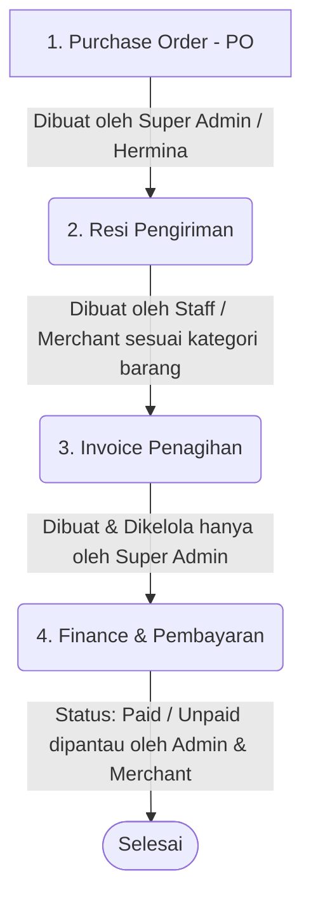
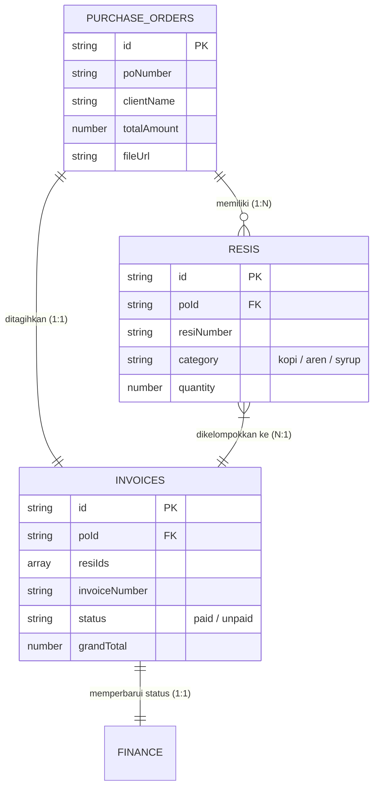

# Alur Aplikasi (Application Flow) - PO Resi Invoice Dashboard

Dokumen ini menjelaskan alur navigasi, otorisasi berbasis peran (RBAC), serta aliran data bisnis utama dari pembuatan Purchase Order hingga proses pembayaran (Finance) dalam aplikasi.

---

## 1. Alur Autentikasi & Proteksi Rute (Auth Flow)

Proses masuk pengguna ke dalam aplikasi diatur melalui Firebase Authentication dan Cookie berbasis HTTP-only.

---

## 2. Matriks Hak Akses Peran (RBAC Matrix)

Aplikasi memiliki 5 tingkat peran pengguna yang dikontrol melalui Custom Claims pada token Firebase. Peran ini membatasi halaman apa yang bisa dikunjungi serta tindakan data (CRUD) apa saja yang diizinkan:

| Peran (Role) | Menu PO | Menu Resi | Menu Invoice | Menu Finance | Keterangan |
| :--- | :--- | :--- | :--- | :--- | :--- |
| **Super Admin** | Full CRUD | Full CRUD | Full CRUD | All Categories | Memiliki kendali penuh atas semua data bisnis. |
| **Hermina Account** | Full CRUD | Read-Only | Read-Only | No Access | Membuat & mengedit PO, memantau resi & invoice terkait. |
| **Staff Account** | Read-Only | Full CRUD | No Access | No Access | Mengelola resi pengiriman logistik. Tidak bisa melihat uang/invoice. |
| **Kopi Merchant** | Read-Only | CRUD (Kopi & Aren) | No Access | Read-Only (Kopi & Aren) | Hanya mengelola resi & melihat finance produk Kopi/Aren. |
| **Syrup Merchant**| Read-Only | CRUD (Syrup) | No Access | Read-Only (Syrup) | Hanya mengelola resi & melihat finance produk Syrup. |

---

## 3. Alur Kerja Bisnis Utama (Core Business Workflow)

Siklus bisnis dalam aplikasi ini mengalir secara berurutan dari kebutuhan pembelian barang hingga pencatatan pembayaran.

### Tahap 1: Pembuatan Purchase Order (PO)
* **Aktor:** Super Admin atau Akun Hermina.
* **Proses:** 
  1. Pengguna masuk ke menu **PO** dan mengklik **Create PO**.
  2. Mengisi nomor PO, klien (Hermina), daftar barang/item, kuantitas target, dan nominal.
  3. Mengunggah berkas PO asli (opsional) ke Firebase Storage.
  4. Data disimpan ke koleksi Firestore `purchase_orders`.

### Tahap 2: Pembuatan Resi Pengiriman
* **Aktor:** Staff Account atau Merchant (Kopi/Syrup).
* **Proses:**
  1. Pengguna masuk ke menu **Resi** dan mengklik **Create Resi**.
  2. Memilih referensi `poId` (menghubungkan resi ke nomor PO tertentu).
  3. Memasukkan nomor resi ekspedisi, kurir, jumlah barang dikirim, dan **Kategori Produk** (Kopi, Aren, atau Syrup).
  4. *Catatan khusus:* Akun Merchant hanya diizinkan memilih kategori produk yang sesuai dengan hak akses dagang mereka.

### Tahap 3: Pembuatan Invoice (Penagihan)
* **Aktor:** Hanya Super Admin.
* **Proses:**
  1. Admin membuka menu **Invoice** dan mengklik **Create Invoice**.
  2. Memilih referensi PO (`poId`) dan mencentang resi-resi pengiriman (`resiIds`) yang sudah selesai dikirim untuk ditagihkan.
  3. Mengisi detail invoice, jatuh tempo, diskon/pajak, dan mengunggah lampiran PDF tagihan.
  4. Status invoice default adalah `unpaid`.

### Tahap 4: Rekonsiliasi Keuangan (Finance)
* **Aktor:** Super Admin (seluruh kategori) dan Merchant (hanya kategori milik mereka).
* **Proses:**
  1. Menu **Finance** menyediakan tabel ringkasan transaksi pembayaran yang terikat dengan Invoice.
  2. Admin memantau dan mengubah status pembayaran menjadi `paid` jika tagihan sudah ditransfer.
  3. Merchant dapat melihat pencatatan arus masuk dana hasil penjualan barang mereka (Kopi/Syrup) secara mandiri untuk transparansi.

---

## 4. Struktur Relasi Data (Data Schema Relationship)

